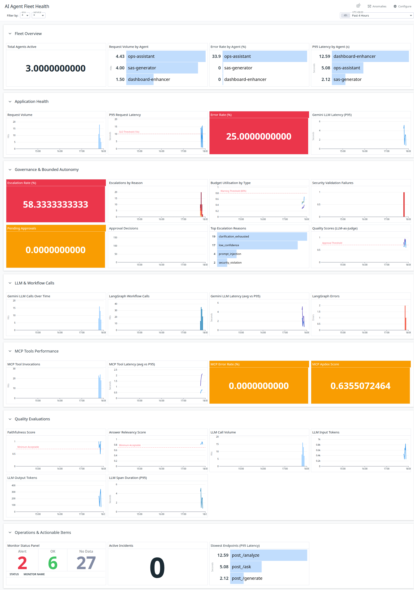
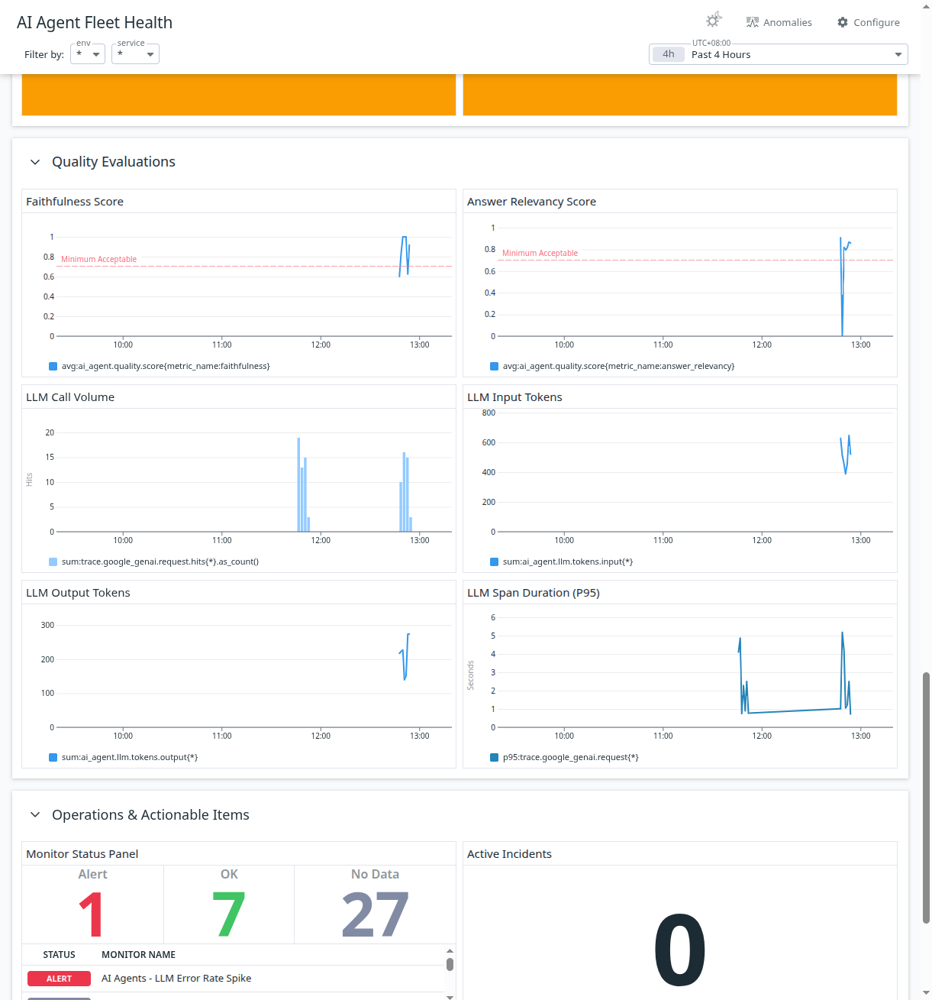
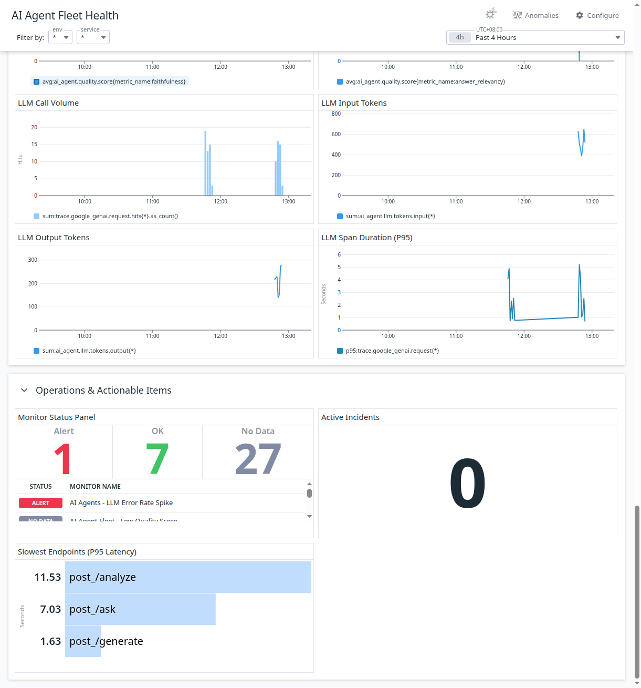
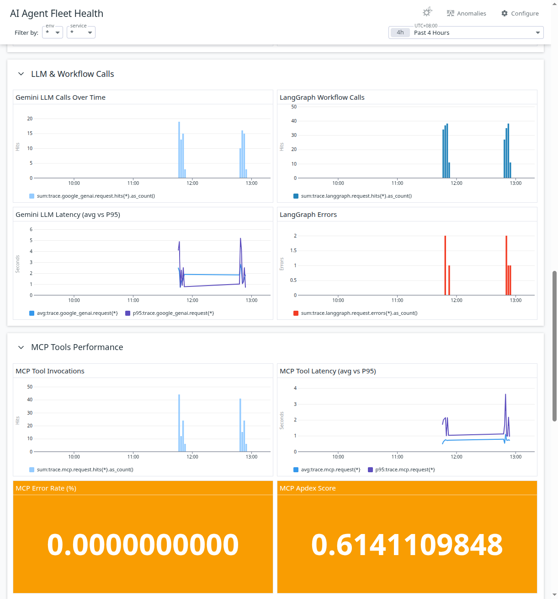
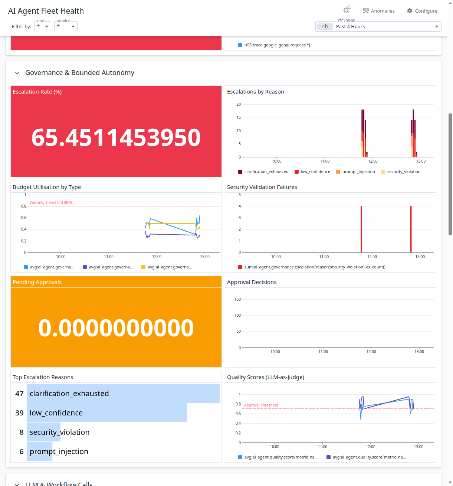

# Cerberus: Scalable Dynamic Multi-Agent Observability Platform

**AI Partner Catalyst: Accelerate Innovation** — Datadog LLM Observability Challenge

A production-grade observability framework for AI agents using Datadog. Any new agent can be onboarded with built-in governance, standardised telemetry, and **dynamically generated personalised dashboards**—while being fully observable through the same Datadog platform it queries.

## The Innovation: Two-Part Scalable AI Agent Observability

This solution implements the governance principles from ["Practices for Governing Agentic AI Systems"](https://arxiv.org/pdf/2512.04123) (OpenAI et al., 2024) combined with a novel **Dynamic Personalised Observability Agent**:

### 1. Governance-First Agent Onboarding

Based on the paper's recommendations for governing AI agents in production, every agent onboarded to this platform receives:

| Governance Principle | Implementation |
|---------------------|----------------|
| **Bounded Autonomy** | Step budgets (max 8 steps), tool call limits (max 6), model call limits (max 5) |
| **Human-in-the-Loop** | Approval gates for high-impact actions, escalation handlers for low-confidence decisions |
| **Graduated Trust** | Confidence thresholds (0.7) that trigger human review when not met |
| **Security Validation** | Prompt injection detection, PII scanning, input sanitisation |
| **Observable Constraints** | All governance limits emit metrics (`ai_agent.governance.*`) for SLO tracking |

The `shared/governance/` module provides factory functions that configure these constraints per-agent:

```python
from shared.governance import create_budget_tracker, create_security_validator

budget = create_budget_tracker("my-agent", max_steps=8, max_tool_calls=6)
security = create_security_validator("my-agent")
```

### 2. Dynamic Personalised Observability Agent

Beyond shared governance, the **Dashboard Enhancement Agent** automatically creates domain-specific observability for each agent:

```
┌─────────────────────────────────────────────────────────────────────────────┐
│                     DASHBOARD ENHANCEMENT AGENT                              │
│                                                                              │
│   ┌─────────────┐    ┌─────────────┐    ┌─────────────┐    ┌─────────────┐  │
│   │  Discovery  │───>│  Proposer   │───>│ Provisioner │───>│  Designer   │  │
│   │             │    │   (LLM)     │    │             │    │   (LLM)     │  │
│   │ • Code      │    │             │    │             │    │             │  │
│   │ • Telemetry │    │ Domain-     │    │ Span-based  │    │ Personalised│  │
│   │ • LLMObs    │    │ specific    │    │ metrics in  │    │ widget      │  │
│   │             │    │ metrics     │    │ Datadog     │    │ group       │  │
│   └─────────────┘    └─────────────┘    └─────────────┘    └─────────────┘  │
│                                                                              │
│   Input: service name, code path/GitHub URL, agent profile                   │
│   Output: Provisioned metrics + widget group added to fleet dashboard        │
└─────────────────────────────────────────────────────────────────────────────┘
```

**Why this matters:** Traditional observability requires manual dashboard creation per service. The Dashboard Enhancement Agent:
- **Analyses** agent code to discover workflow operations, LLM calls, and tool invocations
- **Proposes** domain-specific metrics (e.g., `sas_generator.code.quality.score`) not generic infrastructure metrics
- **Provisions** span-based metrics automatically in Datadog
- **Designs** a personalised widget group using LLM and adds it to the shared fleet dashboard

This enables **zero-touch observability onboarding**—new agents get meaningful, domain-relevant dashboards without manual configuration.

### Combined Architecture

What sets this solution apart is the **scalable, self-referential observability architecture**:

```
┌──────────────────────────────────────────────────────────────────────────────────┐
│                          DATADOG OBSERVABILITY PLATFORM                           │
│                                                                                   │
│  ┌────────────────────────────────────────────────────────────────────────────┐  │
│  │                    AI Agent Fleet Health Dashboard                          │  │
│  │  ┌──────────────┐ ┌──────────────┐ ┌──────────────┐ ┌──────────────────┐   │  │
│  │  │Fleet Overview│ │  App Health  │ │  Governance  │ │ Quality Evals    │   │  │
│  │  │ (all agents) │ │  (per svc)   │ │  (budgets)   │ │ (RAGAS scores)   │   │  │
│  │  └──────────────┘ └──────────────┘ └──────────────┘ └──────────────────┘   │  │
│  └────────────────────────────────────────────────────────────────────────────┘  │
│                                                                                   │
│  ┌─────────────────┐  ┌─────────────────┐  ┌──────────────────────────────────┐  │
│  │ 9 Fleet Monitors│  │   4 Fleet SLOs  │  │    Incident Management           │  │
│  │ team:ai-agents  │  │ (Avail/Latency/ │  │    (Auto-created from monitors)  │  │
│  │ by {service}    │  │  Govern/Quality)│  │                                  │  │
│  └────────┬────────┘  └────────┬────────┘  └────────────────┬─────────────────┘  │
│           │                    │                             │                    │
│           └────────────────────┴─────────────────────────────┘                    │
│                                    ▲                                              │
│                                    │ Telemetry (ai_agent.* metrics)               │
│                                    │                                              │
│  ┌─────────────────────────────────┴──────────────────────────────────────────┐  │
│  │                      SHARED OBSERVABILITY MODULE                            │  │
│  │                      shared/observability/                                  │  │
│  │  ┌──────────────┐  ┌──────────────┐  ┌──────────────┐  ┌──────────────┐    │  │
│  │  │  constants   │  │   metrics    │  │  decorators  │  │  build_tags  │    │  │
│  │  │ (ai_agent.*) │  │ (emit_*)     │  │(@observed_*) │  │(team:ai-agents)│   │  │
│  │  └──────────────┘  └──────────────┘  └──────────────┘  └──────────────┘    │  │
│  └─────────────────────────────────────────────────────────────────────────────┘  │
│                                    ▲                                              │
│        ┌───────────────────────────┼───────────────────────────┐                  │
│        │                           │                           │                  │
│        ▼                           ▼                           ▼                  │
│  ┌───────────────┐         ┌───────────────┐         ┌───────────────┐           │
│  │ OPS ASSISTANT │         │ SAS GENERATOR │         │ FUTURE AGENTS │           │
│  │   (triage)    │         │(code-generation)│        │  (onboard via │           │
│  │               │         │               │         │   Enhancer)   │           │
│  │ service:      │         │ service:      │         │ service:      │           │
│  │ ops-assistant │         │ sas-generator │         │ my-new-agent  │           │
│  └───────┬───────┘         └───────┬───────┘         └───────┬───────┘           │
│          │                         │                         ▲                    │
│          └─────────────────────────┼─────────────────────────┼────────────────┐   │
│                                    │                         │                │   │
│                                    ▼                         │                │   │
│                         ┌─────────────────────┐    ┌────────┴────────┐        │   │
│                         │   MCP TOOL SERVERS  │    │    DASHBOARD    │        │   │
│                         │  (Datadog APIs, SAS)│◄───│    ENHANCER     │────────┘   │
│                         └─────────────────────┘    │ (auto-onboard)  │            │
│                                                    └─────────────────┘            │
└──────────────────────────────────────────────────────────────────────────────────┘
```

**Key innovations:**
1. **Governance-as-Code**: All agents inherit bounded autonomy from `shared/governance/` based on [OpenAI's governance paper](https://arxiv.org/pdf/2512.04123)
2. **Dynamic Observability**: The Dashboard Enhancement Agent analyses new agents and creates personalised metrics/widgets automatically
3. **Fleet-Wide + Per-Agent**: `team:ai-agents` tag enables fleet monitoring, `service:<name>` enables drill-down, personalised widget groups provide domain-specific insights

## Hard Requirements Checklist

| Requirement | Implementation |
|-------------|----------------|
| **Vertex AI / Gemini** | Google Gemini 2.0 Flash via Vertex AI |
| **Telemetry to Datadog** | APM, LLM Observability, Logs, Custom Metrics |
| **3+ Detection Rules** | 9 monitors with incident automation |
| **Actionable Records** | Auto-created incidents with context, runbooks, and signal data |
| **In-Datadog View** | 7-section dashboard with fleet overview and service filtering |
| **Traffic Generator** | 8-mode script demonstrating all detection rules |

## Hosted Applications

| Application | URL | Purpose |
|-------------|-----|---------|
| **Ops Assistant API** | https://ops-assistant-i4ney2dwya-uc.a.run.app | Backend triage agent |
| **Ops Assistant Frontend** | https://ops-assistant-frontend-i4ney2dwya-uc.a.run.app | Chat UI for incident triage |
| **SAS Generator API** | https://sas-generator-api-i4ney2dwya-uc.a.run.app | Backend code generation API |
| **SAS Query Generator UI** | https://sas-query-generator-i4ney2dwya-uc.a.run.app | Streamlit UI for SAS code generation |
| **Dashboard Enhancer API** | https://dashboard-enhancer-api-i4ney2dwya-uc.a.run.app | Automated observability provisioning |
| **Dashboard Enhancer UI** | https://dashboard-enhancer-ui-i4ney2dwya-uc.a.run.app | Web UI for agent onboarding |
| **Dashboard MCP Server** | https://dashboard-mcp-server-i4ney2dwya-uc.a.run.app | MCP tools for Datadog API operations |

## Datadog Organisation

- **Organisation Name**: AI Singapore
- **Region**: ap1 (Asia-Pacific)

### Key Datadog Resources

| Resource | Link |
|----------|------|
| **Dashboard** | https://p.ap1.datadoghq.com/sb/9c600638-dc7c-11f0-b6b4-561844e885ae-c547a3d20805be1c166be03cd945f6d3 |
| **LLM Obs Traces** | https://ap1.datadoghq.com/llm/traces?query=%40ml_app%3Aops-assistant |
| **Monitors** | https://ap1.datadoghq.com/monitors/manage?q=team%3Aai-agents |
| **SLOs** | https://ap1.datadoghq.com/slo?query=team%3Aai-agents |

> **Note:** The Dashboard link is publicly shareable. LLM Obs Traces, Monitors, and SLOs links require authentication to the AI Singapore Datadog organisation.

## Observability Strategy

### Three-Layer Telemetry

```
┌─────────────────────────────────────────────────────────────────┐
│ Layer 1: APM Tracing (Auto-instrumented via ddtrace)            │
│ • Full request traces with span hierarchy                       │
│ • Service map and dependency visualisation                      │
│ • Latency breakdown by component                                │
├─────────────────────────────────────────────────────────────────┤
│ Layer 2: LLM Observability (Decorator-based)                    │
│ • Workflow → Agent → Tool span hierarchy                        │
│ • Input/output capture for debugging                            │
│ • Token usage and cost tracking                                 │
│ • RAGAS quality evaluations (faithfulness, relevancy)           │
├─────────────────────────────────────────────────────────────────┤
│ Layer 3: Custom Metrics (DogStatsD via shared module)           │
│ • Standardised ai_agent.* metric prefix                         │
│ • Fleet tag: team:ai-agents (all agents)                        │
│ • Service tag: service:<name> (per-agent filtering)             │
│ • Governance metrics (steps, tool calls, model calls)           │
│ • Quality scores (confidence, hallucination rate)               │
└─────────────────────────────────────────────────────────────────┘
```

### Shared Observability Module

All agents use the `shared/observability/` module for consistent telemetry:

```python
from shared.observability import (
    emit_request_complete,
    emit_tool_error,
    emit_quality_score,
    timed_request,
    observed_workflow,
    TEAM_AI_AGENTS,
)

# Automatic metric emission with correct tags
with timed_request("my-agent", "my-type") as metrics:
    result = await do_work()
    metrics["llm_calls"] = 1
```

### Shared Governance Module

All agents use the `shared/governance/` module for bounded autonomy:

```python
from shared.governance import (
    create_budget_tracker,
    create_security_validator,
    create_escalation_handler,
    create_approval_gate,
)

# Create governance components for your agent
budget_tracker = create_budget_tracker("my-agent", max_steps=8, max_tool_calls=6)
security_validator = create_security_validator("my-agent")
escalation_handler = create_escalation_handler("my-agent", confidence_threshold=0.7)
approval_gate = create_approval_gate("my-agent")

# Use in your workflow
if security_validator.validate_input(user_input):
    if budget_tracker.can_proceed():
        result = await do_work()
        budget_tracker.record_step()
```

### Governance Metrics

| Metric | Type | Description |
|--------|------|-------------|
| `ai_agent.governance.step_count` | Gauge | Current step count |
| `ai_agent.governance.budget_remaining` | Gauge | Steps remaining before limit |
| `ai_agent.governance.budget_exceeded` | Counter | Budget violation events |
| `ai_agent.security.prompt_injection_blocked` | Counter | Blocked injection attempts |
| `ai_agent.security.pii_detected` | Counter | PII detection events |
| `ai_agent.escalation.handoff_required` | Counter | Human escalation events |
| `ai_agent.approval.pending` | Gauge | Pending approval requests |
| `ai_agent.approval.approved` | Counter | Approved actions |
| `ai_agent.approval.rejected` | Counter | Rejected actions |

### Standard Metrics

| Metric | Type | Description |
|--------|------|-------------|
| `ai_agent.request.count` | Counter | Total requests |
| `ai_agent.request.latency` | Histogram | End-to-end latency (ms) |
| `ai_agent.request.error` | Counter | Failed requests |
| `ai_agent.llm.calls` | Counter | LLM invocations |
| `ai_agent.tool.calls` | Counter | Tool invocations |
| `ai_agent.tool.errors` | Counter | Tool failures |
| `ai_agent.quality.score` | Gauge | Quality evaluation score (0-1) |
| `ai_agent.step_budget_exceeded` | Counter | Runaway agent events |
| `ai_agent.handoff_required` | Counter | Human escalation events |

### Dashboard (7 Widget Groups)

| Section | Signals Monitored |
|---------|-------------------|
| **Fleet Overview** | Active agents, request volume by service, error rate by service |
| **Application Health** | Request volume, P95 latency, error rate, Gemini LLM latency |
| **Governance & Autonomy** | LLM calls, workflow executions, step budgets, tool limits |
| **MCP Tools Performance** | Tool invocations, latency (avg/P95), error rate, Apdex score |
| **Quality Evaluations** | RAGAS faithfulness/relevancy, confidence scores, hallucination rate |
| **Operations** | Monitor status panel, incidents/cases, worst traces |
| **SAS Query Generator** | Query volume, generation latency, user feedback, error rate |

### Detection Rules (9 Monitors)

All monitors use `team:ai-agents by {service}` for fleet-wide coverage with per-agent alerting:

| Monitor | Threshold | Severity | Rationale |
|---------|-----------|----------|-----------|
| **High P95 Latency** | >10s | P3 | User experience degradation |
| **Agent Step Budget Exceeded** | >0 events | P3 | Runaway agent detection |
| **Tool Error Rate Spike** | >10% | P2 | MCP/Datadog API issues |
| **Quality Degradation** | faithfulness <0.7 | P2 | Model output quality drop |
| **Hallucination Rate High** | >10% | P1 | Critical accuracy issue |
| **PII Detection Alert** | any PII detected | P1 | Data privacy violation |
| **MCP Server Connection Issues** | >5 errors | P1 | Infrastructure failure |
| **Token Budget Spike** | >50k tokens | P3 | Cost anomaly detection |
| **LLM Error Rate Spike** | >5% | P2 | Service reliability issues |

**Each monitor automatically creates an incident with:**
- Signal data (metric values, timestamps, affected services)
- Runbook link for remediation steps
- Context tags for filtering and correlation
- Severity-based notification routing

### SLOs (4 Fleet-Wide Targets)

| SLO | Target (30d) | Target (7d) | Error Budget |
|-----|--------------|-------------|--------------|
| **Availability** | 99.9% | 99.5% | 43.2 min/month |
| **Latency** | 95% <10s | 90% <10s | 5% slow requests |
| **Governance** | 99% within budgets | 95% | 1% budget violations |
| **Quality** | 99.5% hallucination-free | 99% | 0.5% hallucinations |

## Bounded Autonomy: Governance as Observability

Rather than treating governance as an afterthought, this solution treats **governance constraints as measurable SLOs**:

| Control | Limit | Observable As |
|---------|-------|---------------|
| Max Agent Steps | 8 (hard cap: 10) | `ai_agent.step_budget_exceeded` |
| Max Model Calls | 5 | `ai_agent.llm.calls` counter |
| Max Tool Calls | 6 | `ai_agent.tool.calls` counter |
| Confidence Threshold | 0.7 | Quality evaluation scores |
| Human Approval | Required for incidents | `ai_agent.handoff_required` |

This makes AI agent behaviour **predictable, debuggable, and continuously improvable** through standard SRE practices.

---

## Competition Requirements Achievement

**Datadog AI Agents Competition** — How each requirement was achieved.

**Public Dashboard URL**: https://p.ap1.datadoghq.com/sb/9c600638-dc7c-11f0-b6b4-561844e885ae-c547a3d20805be1c166be03cd945f6d3

### Requirement 1: In-Datadog View for Application Health

> Provide an in-Datadog view that clearly shows your application health (e.g. latency/errors/tokens/cost), SLOs, and actionable items from the detection rules you defined.

The **"AI Agent Fleet Health"** dashboard provides a comprehensive view of application health across our 3-agent fleet (ops-assistant, sas-generator, dashboard-enhancer).



#### Fleet Overview Section


| Widget | Metric Query | Purpose |
|--------|--------------|---------|
| **Total Agents Active** | `count_nonzero(avg:trace.fastapi.request.hits{team:ai-agents} by {service})` | Shows 3 active agents |
| **Request Volume by Agent** | `sum:trace.fastapi.request.hits{*} by {service}.as_count()` | Traffic distribution |
| **Error Rate by Agent (%)** | Formula: `(errors / hits) * 100` | Error visibility per agent |
| **P95 Latency by Agent (s)** | `p95:trace.fastapi.request{*} by {service}` | Latency performance |

#### Application Health Section

| Widget | Description |
|--------|-------------|
| **Request Volume** | Time-series of `sum:trace.fastapi.request.hits{*}.as_count()` |
| **P95 Request Latency** | With **SLO Threshold (10s)** marker line |
| **Error Rate (%)** | Query value widget showing current error percentage |
| **Gemini LLM Latency (P95)** | `p95:trace.google_genai.request{*}` for LLM performance |

#### Token/Cost Tracking



| Widget | Metric | Purpose |
|--------|--------|---------|
| **LLM Input Tokens** | `sum:ai_agent.llm.tokens.input{*}` | Input token consumption |
| **LLM Output Tokens** | `sum:ai_agent.llm.tokens.output{*}` | Output token consumption |
| **LLM Call Volume** | `sum:trace.google_genai.request.hits{*}.as_count()` | API call frequency |
| **LLM Span Duration (P95)** | `p95:trace.google_genai.request{*}` | LLM response time |

#### SLO Visibility

- **P95 Request Latency chart**: Green dashed line at **10 seconds** (SLO threshold)
- **Budget Utilisation chart**: Orange dashed line at **80%** (warning threshold)
- **Quality Scores chart**: Red dashed line at **0.7** (approval threshold)

#### Actionable Items Panel



- **Monitor Status Panel**: Shows alerts, OK, and No Data counts across monitors
- **Active Incidents**: Count of open incidents
- **Slowest Endpoints (P95 Latency)**: Identifies performance bottlenecks

---

### Requirement 2: Actionable Record (Incident/Case Management)

> Create an actionable record inside Datadog with clear contextual information to drive next steps. (Incident Management or Case Management)

Monitors are configured to automatically create incidents with comprehensive context when triggered.

#### Monitor-to-Incident Flow

Each monitor in `infra/datadog/monitors.json` includes structured alert messages:

```json
{
  "name": "AI Agent Fleet - Security Violation Spike",
  "message": "## Summary\nSecurity validation failures detected across AI agent fleet.\n\n## Impact\n- Potential prompt injection or attack attempts\n- Security policy enforcement active\n\n## What Triggered\n- Monitor: Fleet Security Violation Spike\n- Window: Last 5 minutes\n- Threshold: violations > 3\n- Violation count: {{value}}\n\n## Next Actions\n- [ ] Review blocked requests immediately\n- [ ] Check for attack patterns\n- [ ] Verify security validator rules\n\n@ops-oncall @security-team"
}
```

#### Notification Channels

| Monitor Type | Notification Channels |
|--------------|----------------------|
| Security Violations | `@ops-oncall @security-team` |
| PII Detection | `@ops-oncall @privacy-team` |
| Quality Issues | `@ops-oncall @ml-team` |
| Approval Backlog | `@ops-oncall @approval-team` |

---

### Requirement 3: Vertex AI or Gemini as Model Host

> Applications must leverage Vertex AI or Gemini as the model host.

All three agents use **Google Gemini via Vertex AI**.

#### Client Initialisation Pattern

```python
# sas_generator/workflow.py
def get_genai_client() -> genai.Client:
    return genai.Client(
        vertexai=True,
        project=settings.gcp_project_id,
        location=settings.gcp_location,
    )
```

#### Models Used Across Fleet

| Service | Model | Use Case |
|---------|-------|----------|
| ops-assistant | `gemini-1.5-flash` | Intent classification, synthesis |
| sas-generator | `gemini-2.0-flash-exp` | SAS code generation, quality evaluation |
| dashboard-enhancer | `gemini-2.0-flash-001` | Widget design, domain evaluation |

#### Dashboard Evidence



| Widget | Metric |
|--------|--------|
| Gemini LLM Calls Over Time | `sum:trace.google_genai.request.hits{*}.as_count()` |
| Gemini LLM Latency (avg vs P95) | `avg:trace.google_genai.request{*}` / `p95:trace.google_genai.request{*}` |

---

### Requirement 4: Telemetry Data Reporting

> Report your application telemetry data to Datadog (e.g., LLM observability signals, APM, logs, infrastructure metrics, RUM, etc.)

The application implements a comprehensive multi-layer observability strategy.

#### 1. LLM Observability (ddtrace LLMObs)

```python
# ops_triage_agent/observability.py
def setup_llm_observability():
    LLMObs.enable(
        ml_app=settings.dd_service,
        api_key=settings.dd_api_key,
        site=settings.dd_site,
        agentless_enabled=True,
        integrations_enabled=True,
    )
```

#### LLMObs Decorators Used

| Decorator | Purpose |
|-----------|---------|
| `@workflow` | Wraps entire code generation flow |
| `@llm(model_name="gemini-2.0-flash-exp", model_provider="google")` | Traces LLM calls |
| `@tool(name="get_schema")` | Traces tool invocations |
| `LLMObs.agent(name="agent.intake")` | Agent span creation |

#### 2. APM Instrumentation (ddtrace-run)

```dockerfile
ENTRYPOINT ["ddtrace-run"]
CMD ["uvicorn", "ops_triage_agent.main:app", "--host", "0.0.0.0", "--port", "8080"]

ENV DD_TRACE_ENABLED=true
ENV DD_LOGS_INJECTION=true
ENV DD_LLMOBS_ENABLED=1
```

#### 3. Custom Metrics (DogStatsD)

| Metric | Type | Purpose |
|--------|------|---------|
| `ai_agent.request.latency` | Histogram | Request duration |
| `ai_agent.llm.tokens.input` | Gauge | Input token count |
| `ai_agent.llm.tokens.output` | Gauge | Output token count |
| `ai_agent.governance.escalation` | Counter | Escalation events |
| `ai_agent.governance.budget_utilisation` | Gauge | Budget consumption |
| `ai_agent.quality.score` | Gauge | Quality evaluations |

#### 4. Infrastructure Metrics (Datadog Sidecar)

```yaml
# infra/cloudrun/sas-generator-api-sidecar.yaml
- name: datadog-agent
  image: gcr.io/datadoghq/serverless-init:latest
  env:
    - name: DD_APM_ENABLED
      value: "true"
    - name: DD_DOGSTATSD_PORT
      value: "8125"
    - name: DD_LOGS_ENABLED
      value: "true"
```

---

### Requirement 5: At Least 3 Detection Rules

> Define at least 3 detection rules in Datadog to evaluate application signals and determine when the app requires attention (e.g., monitors/SLOs).

We defined **6 monitors** and **4 SLOs** for a total of **10 detection rules**.

#### Monitors (6 Total)

| Monitor | Query | Threshold |
|---------|-------|-----------|
| **Governance Escalation Rate** | `sum:ai_agent.governance.escalation{team:ai-agents}.as_count()` | > 10 (15m) |
| **Security Violation Spike** | `sum:ai_agent.governance.escalation{reason:security_violation}.as_count()` | > 3 (5m) |
| **PII Detection** | `sum:ai_agent.governance.escalation{reason:pii_detected}.as_count()` | > 0 (15m) |
| **Budget Utilisation High** | `avg:ai_agent.governance.budget_utilisation{team:ai-agents}` | > 0.8 |
| **Approval Queue Backlog** | `sum:ai_agent.governance.approval_pending{team:ai-agents}.as_count()` | > 20 (5m) |
| **Low Quality Score** | `avg:ai_agent.quality_score{score_type:code_quality}` | < 0.7 |

#### SLOs (4 Total)

| SLO | Target | Timeframe |
|-----|--------|-----------|
| **Availability SLO** | 99.9% requests complete without errors | 30d |
| **Latency SLO** | 95% of time, P95 latency < 10s | 30d |
| **Governance SLO** | 99% requests within step budgets, no tool failures | 30d |
| **Quality SLO (Hallucination-Free)** | 99.5% requests without hallucinations | 30d |

---

### Requirement 6: Actionable Record with Contextual Information

> Create an actionable record inside Datadog with clear contextual information to drive next steps (E.g. Signal Data, Runbook, context around the signal).

Every monitor alert includes structured contextual information:

```markdown
## Summary
[Clear description of the issue]

## Impact
- [Business impact bullet points]
- Team: {{team.name}}

## What Triggered
- Monitor: [Monitor Name]
- Window: [Evaluation window]
- Threshold: [Condition]
- Current value: {{value}}

## Next Actions
- [ ] [Actionable step 1]
- [ ] [Actionable step 2]
- [ ] [Actionable step 3]

@[notification-channel]
```

#### Contextual Information Types

| Context Type | Example |
|--------------|---------|
| **Signal Data** | `{{value}}`, `{{team.name}}` template variables |
| **Threshold Info** | "violations > 3" in What Triggered section |
| **Runbook Steps** | Checklist items in Next Actions section |
| **Escalation Path** | `@ops-oncall @security-team` notifications |

---

### Requirement 7: Comprehensive Dashboard View

> Provide an in-Datadog view that clearly shows application health from the relevant signals collected, detection rules status and any actionable items status derived from your detection rules.

The **"AI Agent Fleet Health"** dashboard combines all requirements into a unified view with 7 widget groups and 30+ widgets.

#### Dashboard Structure

| Group | Widgets | Purpose |
|-------|---------|---------|
| **Fleet Overview** | 4 | High-level fleet health metrics |
| **Application Health** | 4 | Request metrics, latency, errors, LLM performance |
| **Governance & Bounded Autonomy** | 8 | Escalations, budgets, approvals, quality scores |
| **LLM & Workflow Calls** | 4 | Gemini calls, LangGraph workflows |
| **MCP Tools Performance** | 4 | Tool invocations, latency, errors |
| **Quality Evaluations** | 6 | Faithfulness, relevancy, token usage |
| **Operations & Actionable Items** | 3 | Monitor status, incidents, slow endpoints |

#### Governance & Bounded Autonomy Section



| Widget | Metric | Purpose |
|--------|--------|---------|
| **Escalation Rate (%)** | Formula calculation | Percentage of requests requiring escalation |
| **Escalations by Reason** | `sum:ai_agent.governance.escalation{*} by {reason}` | Breakdown by cause |
| **Budget Utilisation by Type** | `avg:ai_agent.governance.budget_utilisation{*} by {budget_type}` | Step/model/tool budgets |
| **Top Escalation Reasons** | TopList widget | Most common escalation causes |

#### Visual Threshold Markers

| Chart | Marker | Value |
|-------|--------|-------|
| P95 Request Latency | SLO Threshold | 10s |
| Budget Utilisation | Warning Threshold | 80% |
| Quality Scores | Approval Threshold | 0.7 |

---

### Requirements Summary

| Requirement | Implementation | Evidence |
|-------------|----------------|----------|
| **1. Application Health View** | AI Agent Fleet Health dashboard with 7 widget groups | Screenshots in `images/` |
| **2. Incident Management** | Monitor alerts auto-create incidents with context | `monitors.json` message templates |
| **3. Vertex AI/Gemini** | All 3 agents use `google.genai` with `vertexai=True` | Code in `workflow.py`, `nodes.py` |
| **4. Telemetry Reporting** | LLMObs, APM, logs, DogStatsD, sidecar | `observability.py`, `metrics.py` |
| **5. Detection Rules** | 6 monitors + 4 SLOs = 10 rules | `monitors.json`, `slos.json` |
| **6. Contextual Records** | Structured alert messages with runbooks | Monitor message templates |
| **7. Comprehensive View** | Dashboard combines health, rules, actionable items | Operations section |

---

## Tech Stack

| Component | Technology |
|-----------|------------|
| **LLM** | Google Gemini 2.0 Flash via Vertex AI |
| **Agent Framework** | LangGraph (structured multi-step workflows) |
| **Tool Interface** | Model Context Protocol (MCP) via FastMCP |
| **Backend API** | FastAPI + Uvicorn |
| **Frontend** | Streamlit |
| **Observability** | Datadog (APM, LLM Obs, Logs, Metrics, Incidents) |
| **Quality Evaluation** | RAGAS (faithfulness, answer relevancy) |
| **Deployment** | Google Cloud Run with Datadog Agent sidecar |
| **Package Management** | uv |

## Quick Start

### Prerequisites

- Python 3.11+
- [uv](https://docs.astral.sh/uv/) package manager
- Datadog account with API and App keys
- Google Cloud project with Vertex AI enabled

### Installation

```bash
# Clone the repository
git clone https://github.com/BrianIsaac/AI-Partner-Catalyst.git
cd AI-Partner-Catalyst/ops-assistant

# Install dependencies
uv sync
```

### Configuration

```bash
# Copy environment template
cp .env.example .env
```

Edit `.env` with your credentials:

```bash
# Datadog
DD_API_KEY=your_datadog_api_key
DD_APP_KEY=your_datadog_app_key
DD_SITE=ap1.datadoghq.com  # or your region

# Google Cloud
GOOGLE_CLOUD_PROJECT=your_project_id
VERTEX_LOCATION=us-central1
GEMINI_MODEL=gemini-2.0-flash-001

# Service Configuration
DD_SERVICE=ops-assistant
DD_ENV=development
```

### Running Locally

```bash
# Terminal 1: Start MCP server
uv run python -m ops_triage_mcp_server.server

# Terminal 2: Start Ops Assistant backend API
uv run uvicorn ops_triage_agent.main:app --host 0.0.0.0 --port 8080

# Terminal 3: Start Ops Assistant Frontend
OPS_TRIAGE_AGENT_URL=http://localhost:8080 uv run streamlit run ops_assistant_frontend/app.py

# Terminal 4: Start SAS Generator backend API
uv run uvicorn sas_generator.main:app --host 0.0.0.0 --port 8082

# Terminal 5: Start SAS Generator Frontend
SAS_API_URL=http://localhost:8082 uv run streamlit run sas_generator/app.py --server.port=8502

# Terminal 6: Start Dashboard MCP Server
uv run python -m dashboard_mcp_server.server

# Terminal 7: Start Dashboard Enhancer API
DASHBOARD_MCP_SERVER_URL=http://localhost:8084/mcp uv run uvicorn dashboard_enhancer.main:app --host 0.0.0.0 --port 8083

# Terminal 8: Start Dashboard Enhancer UI
DASHBOARD_API_URL=http://localhost:8083 uv run streamlit run dashboard_enhancer/app.py --server.port=8503
```

### Running with Docker

```bash
# Build all images
docker build -f Dockerfile-ops-triage-mcp-server -t ops-mcp-server .
docker build -f Dockerfile-ops-triage-agent -t ops-agent .
docker build -f Dockerfile-ops-frontend -t ops-frontend .
docker build -f Dockerfile-sas-generator-api -t sas-generator-api .
docker build -f Dockerfile-sas-generator-ui -t sas-generator-ui .
docker build -f Dockerfile-dashboard-mcp-server -t dashboard-mcp-server .
docker build -f Dockerfile-dashboard-enhancer-api -t dashboard-enhancer-api .
docker build -f Dockerfile-dashboard-enhancer-ui -t dashboard-enhancer-ui .

# Run with environment variables
docker run -p 8081:8080 --env-file .env ops-mcp-server
docker run -p 8080:8080 --env-file .env -e MCP_SERVER_URL=http://host.docker.internal:8081 ops-agent
docker run -p 8501:8080 -e OPS_TRIAGE_AGENT_URL=http://host.docker.internal:8080 ops-frontend
docker run -p 8082:8080 --env-file .env sas-generator-api
docker run -p 8502:8080 -e SAS_API_URL=http://host.docker.internal:8082 sas-generator-ui
docker run -p 8084:8080 --env-file .env dashboard-mcp-server
docker run -p 8083:8080 --env-file .env -e DASHBOARD_MCP_SERVER_URL=http://host.docker.internal:8084/mcp dashboard-enhancer-api
docker run -p 8503:8080 -e DASHBOARD_API_URL=http://host.docker.internal:8083 dashboard-enhancer-ui
```

### Deploy to Cloud Run

```bash
# Deploy Ops Assistant MCP server
gcloud builds submit --config cloudbuild-ops-mcp.yaml

# Deploy Ops Assistant API with Datadog sidecar
gcloud run services replace infra/cloudrun/service-with-sidecar.yaml --region us-central1

# Deploy SAS Generator API with Datadog sidecar
gcloud builds submit --config cloudbuild-sas-generator-api.yaml \
  --substitutions=COMMIT_SHA=$(git rev-parse --short HEAD)

# Deploy frontends
gcloud builds submit --config cloudbuild-ops-frontend.yaml
gcloud builds submit --config cloudbuild-sas-generator.yaml

# Deploy Dashboard Enhancer services
gcloud builds submit --config cloudbuild-dashboard-mcp.yaml \
  --substitutions=COMMIT_SHA=$(git rev-parse --short HEAD)
gcloud builds submit --config cloudbuild-dashboard-enhancer-api.yaml \
  --substitutions=COMMIT_SHA=$(git rev-parse --short HEAD)
gcloud builds submit --config cloudbuild-dashboard-enhancer-ui.yaml \
  --substitutions=COMMIT_SHA=$(git rev-parse --short HEAD)
```

## Traffic Generator

Generate test traffic to verify observability and trigger detection rules:

```bash
# Normal triage questions (baseline)
uv run python scripts/traffic_gen.py --mode normal --rps 0.5 --duration 60

# Trigger latency alerts (long complex prompts)
uv run python scripts/traffic_gen.py --mode latency --rps 0.5 --duration 30

# Test quality monitoring (fictional services)
uv run python scripts/traffic_gen.py --mode hallucination --rps 0.5 --duration 30

# Test PII detection (emails, SSNs, credit cards in queries)
uv run python scripts/traffic_gen.py --mode pii_test --rps 0.5 --duration 30

# Test tool error handling (non-existent services)
uv run python scripts/traffic_gen.py --mode tool_error --rps 0.5 --duration 30

# Test step budget (vague queries requiring many iterations)
uv run python scripts/traffic_gen.py --mode runaway --rps 0.5 --duration 30

# Test all modes sequentially
uv run python scripts/traffic_gen.py --mode all --rps 0.5 --duration 120

# SAS Generator traffic
uv run python scripts/traffic_gen.py --service sas --rps 0.5 --duration 60

# Both services (fleet mode)
uv run python scripts/traffic_gen.py --service fleet --rps 0.5 --duration 60
```

### Available Modes

| Mode | Purpose | Monitor Triggered |
|------|---------|-------------------|
| `normal` | Standard triage questions | Baseline metrics, request volume |
| `latency` | Long complex prompts | High P95 Latency |
| `runaway` | Vague queries forcing many iterations | Step Budget Exceeded |
| `tool_error` | Queries for non-existent services | Tool Error Rate Spike |
| `hallucination` | Fictional service scenarios | Quality Degradation, Hallucination Rate |
| `pii_test` | Queries containing PII data | PII Detection Alert |
| `low_confidence` | Ambiguous/vague questions | Escalation metrics |
| `mcp_health` | Invalid tool calls | MCP Connection Issues |
| `governance` | Combined governance tests (PII, injection, budget) | Security, Escalation monitors |
| `prompt_injection` | Injection attack patterns | Security Validator |
| `all` | Runs all modes sequentially | All monitors |

### Service Targets

| Service | Flag | Description |
|---------|------|-------------|
| `ops` | `--service ops` | Ops Assistant API (default) |
| `sas` | `--service sas` | SAS Generator API |
| `fleet` | `--service fleet` | Both services concurrently |

## Onboarding New Agents

### Recommended: Dashboard Enhancement Agent

The **Dashboard Enhancement Agent** provides AI-driven automated onboarding. It analyses your agent's code and telemetry to create personalised observability:

```bash
# Using the Web UI
open https://dashboard-enhancer-ui-i4ney2dwya-uc.a.run.app

# Or via API
curl -X POST https://dashboard-enhancer-api-i4ney2dwya-uc.a.run.app/analyze \
  -H "Content-Type: application/json" \
  -d '{"service": "my-new-agent", "agent_profile": {"domain": "research", "agent_type": "assistant"}}'
```

The Dashboard Enhancer:
1. **Discovers** workflow operations, LLM calls, and tool invocations from code and telemetry
2. **Proposes** domain-specific metrics using Gemini (not generic infrastructure metrics)
3. **Provisions** span-based metrics in Datadog automatically
4. **Designs** a personalised widget group and adds it to the fleet dashboard

### Alternative: Script-Based Onboarding

For manual control, use the onboarding script:

```bash
python scripts/onboard_agent.py \
    --service my-new-agent \
    --agent-type research \
    --create-monitors \
    --create-slos
```

This will:
1. Add your service to the dashboard template variables
2. Generate monitor configurations (7 types)
3. Generate SLO configurations (6 types)
4. Provide deployment instructions

For detailed integration instructions, see [AGENT_ONBOARDING.md](AGENT_ONBOARDING.md).

### Factory Scripts

Generate individual configurations:

```bash
# List available monitor types
python scripts/create_monitor.py --list-types

# Create specific monitor
python scripts/create_monitor.py --service my-agent --type latency

# Create all monitors for a service
python scripts/create_monitor.py --service my-agent --all -o monitors-my-agent.json

# List available SLO types
python scripts/create_slo.py --list-types

# Create fleet-wide SLO config
python scripts/create_slo.py --fleet-config
```

## Project Structure

```
ops-assistant/
├── AGENT_ONBOARDING.md         # Step-by-step agent onboarding guide
│
├── shared/                     # Shared utilities across all agents
│   ├── observability/          # Standardised telemetry module
│   │   ├── __init__.py         # Public API exports
│   │   ├── constants.py        # ai_agent.* metrics, team:ai-agents tag
│   │   ├── metrics.py          # emit_* functions, timed_request
│   │   └── decorators.py       # @observed_workflow decorator
│   └── governance/             # Bounded autonomy module
│       ├── __init__.py         # Factory functions and exports
│       ├── budget.py           # BudgetTracker (steps, tool calls, model calls)
│       ├── security.py         # SecurityValidator (prompt injection, PII)
│       ├── escalation.py       # EscalationHandler (confidence, handoff)
│       └── approval.py         # ApprovalGate (human-in-the-loop)
│
├── ops_triage_agent/           # Backend API for incident triage
│   ├── main.py                 # FastAPI application with /ask, /triage, /review
│   ├── config.py               # Pydantic settings management
│   ├── observability.py        # LLM Obs + DogStatsD metrics
│   ├── security.py             # Prompt injection & PII detection
│   ├── evaluation.py           # Custom quality evaluations
│   ├── agent/                  # LangGraph workflow
│   │   ├── workflow.py         # 8-node state machine
│   │   ├── state.py            # TypedDict state schema
│   │   └── nodes.py            # Node implementations
│   ├── mcp_client/             # MCP client wrapper
│   ├── models/                 # Pydantic request/response schemas
│   └── prompts/                # System prompts (intake, synthesis, incident)
│
├── ops_triage_mcp_server/      # MCP server for Datadog tools
│   ├── server.py               # FastMCP entry point
│   └── tools/                  # 6 tool modules
│       ├── metrics.py          # APM metrics query
│       ├── logs.py             # Log search
│       ├── traces.py           # Span query
│       ├── incidents.py        # Incident management
│       ├── monitors.py         # Monitor status
│       └── dashboards.py       # Dashboard listing
│
├── ops_assistant_frontend/     # Streamlit chat UI
├── sas_generator/              # SAS code generation agent
├── sas_mcp_server/             # SAS data tools MCP server
│
├── dashboard_enhancer/         # Automated observability provisioning agent
│   ├── main.py                 # FastAPI with /analyze, /provision, /rollback
│   ├── app.py                  # Streamlit UI for agent onboarding
│   ├── workflow.py             # Two-phase workflow orchestration
│   ├── discovery/              # Service discovery (code + telemetry analysis)
│   ├── analyzer/               # Code analysis for operation extraction
│   ├── proposer/               # LLM-driven metric proposal
│   ├── designer/               # LLM-driven widget group design
│   ├── provisioner/            # Span-based metrics provisioning
│   └── mcp_client/             # Client for Dashboard MCP Server
│
├── dashboard_mcp_server/       # MCP server for Datadog API operations
│   ├── server.py               # FastMCP entry point (18 tools)
│   └── tools/                  # Tool modules
│       ├── dashboards.py       # Dashboard CRUD + widget groups
│       ├── monitors.py         # Monitor creation (single + batch)
│       ├── slos.py             # SLO creation (single + batch)
│       ├── spans_metrics.py    # Span-based metrics CRUD
│       └── llm_obs.py          # LLM Observability spans + evaluations
│
├── scripts/
│   ├── onboard_agent.py        # Automated agent onboarding
│   ├── create_monitor.py       # Monitor configuration factory (7 types)
│   ├── create_slo.py           # SLO configuration factory (6 types)
│   ├── traffic_gen.py          # 8-mode traffic generator
│   └── test_shared_observability.py  # Metric submission test
│
├── infra/
│   ├── cloudrun/               # Cloud Run deployment configs
│   │   ├── service-with-sidecar.yaml      # Ops Assistant + Datadog sidecar
│   │   ├── sas-generator-api-sidecar.yaml # SAS Generator API + Datadog sidecar
│   │   └── deploy.sh           # Deployment scripts
│   └── datadog/                # Datadog configuration
│       ├── dashboard.json      # 7-section unified dashboard
│       ├── monitors.json       # 9 fleet-wide detection rules
│       ├── slos.json           # 4 fleet-wide SLO definitions
│       └── apply_config.sh     # Configuration deployment
│
├── submission/                 # Hackathon submission artifacts
│   ├── dashboard.json          # Dashboard export
│   ├── monitors.json           # Monitors export
│   ├── slos.json               # SLOs export
│   └── screenshots/            # Evidence screenshots
│
├── Dockerfile-*                # Container definitions (6 total)
├── cloudbuild-*.yaml           # Cloud Build configs (5 total)
└── pyproject.toml              # Project dependencies (uv)
```

## API Endpoints

| Endpoint | Method | Description |
|----------|--------|-------------|
| `/health` | GET | Health check with dependency status |
| `/ask` | POST | Free-form triage question |
| `/triage` | POST | Structured triage with service/environment |
| `/review` | POST | Human approval decision for pending incidents |

### Example Request

```bash
curl -X POST https://ops-assistant-i4ney2dwya-uc.a.run.app/ask \
  -H "Content-Type: application/json" \
  -d '{
    "question": "Why is api-gateway experiencing high latency?",
    "service": "api-gateway",
    "time_window": "last_15m"
  }'
```

### Example Response

```json
{
  "summary": "API Gateway latency spike correlated with database connection pool exhaustion",
  "hypotheses": [
    {
      "rank": 1,
      "hypothesis": "Database connection pool exhausted",
      "confidence": 0.85,
      "evidence": ["Error logs showing 'connection pool exhausted'", "DB latency P99 at 2.3s"],
      "next_steps": ["Scale connection pool", "Check for connection leaks"]
    }
  ],
  "confidence": 0.85,
  "requires_approval": false,
  "governance": {
    "steps_used": 4,
    "tool_calls": 3,
    "model_calls": 2
  }
}
```

## Submission Artifacts

All required Datadog configuration exports are in `submission/`:

| File | Contents |
|------|----------|
| `dashboard.json` | 7-section dashboard with fleet overview and multi-service filtering |
| `monitors.json` | 9 detection rules with incident automation |
| `slos.json` | 4 SLO definitions (availability, latency, governance, quality) |
| `screenshots/` | Evidence of functioning observability |

## Video Walkthrough

[Link to 3-minute video walkthrough]

**Topics Covered:**

1. **Innovation 1: Governance-First Agent Onboarding** — How `shared/governance/` provides bounded autonomy controls that automatically emit observability signals. Detection rules are derived from governance behaviour, not bolted on afterwards.

2. **Innovation 2: Dynamic Personalised Observability Agent** — The Dashboard Enhancement Agent's 4-phase workflow (Discovery → Proposer → Provisioner → Designer) that automatically creates domain-specific metrics and widgets for new agents.

3. **Challenges Faced** — Cloud Run sidecar pattern, SLO tag indexing, LLM query validation, and service-to-service authentication.

## License

Apache License 2.0. See [LICENSE](LICENSE) for details.

---

**Built for the Datadog LLM Observability Challenge** — demonstrating that AI agents deserve the same rigorous observability we give to any production system.
